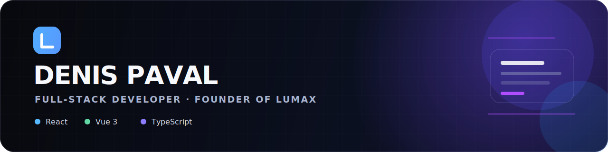

# Hi, I'm Denis 👋

Full-stack web developer and founder of [Lumax](https://lumax.agency) — a founder-led web studio based in Romania.

I build fast business websites, landing pages, and web applications with React, Vue, and TypeScript — with a clear path from scope to launch.

**By day** I work on enterprise document-management systems for public institutions (Vue 3, TypeScript, C#/.NET, SQL Server, Docker) — systems where audit trails, role-based permissions, and uptime actually matter.

## Selected work

- **[Car Zone](https://car-zone-five.vercel.app/)** — automotive marketplace with filterable inventory, vehicle detail pages, financing calculator, and enquiry flows. *(HTML/SCSS/JS · [case study](https://www.lumax.agency/work/car-zone) · [source](https://github.com/Ciokapick/car-zone-portfolio))*
- **[Glam Essence](https://glam-essence.netlify.app/)** — editorial e-commerce storefront with a complete shopping flow and a transactional SQLite commerce backend. *(React, TypeScript, Node · [case study](https://www.lumax.agency/work/glam-essence) · [source](https://github.com/Ciokapick/glam-essence))*
- **[AutoCar X](https://autocarx.netlify.app/)** — premium automotive service experience with a service estimator and workshop lead management. *(React, TypeScript, Node · [case study](https://www.lumax.agency/work/autocarx) · [source](https://github.com/Ciokapick/autocarx))*
- **[GarageBoard](https://ciokapick.github.io/garage-board/)** — workshop operations dashboard with a work-order pipeline, validated intake, customer history, and reporting. *(Vue 3, TypeScript, Pinia · [source](https://github.com/Ciokapick/garage-board))*

## Currently building

- 🏥 A medical practice management platform — React, NestJS, Prisma, PostgreSQL. Privacy-by-design, GDPR-first.
- 🚗 More automotive web experiences — it's a niche I know from both sides: I build the sites *and* I know what a timing chain costs.

## Stack

`React` `Vue 3` `TypeScript` `Next.js` `Node / NestJS` `C# / .NET` `PostgreSQL` `SQL Server` `SQLite` `Prisma` `Tailwind` `Docker`

## Work with me

- 🌐 [lumax.agency](https://lumax.agency)
- ✉️ contact@lumax.agency
